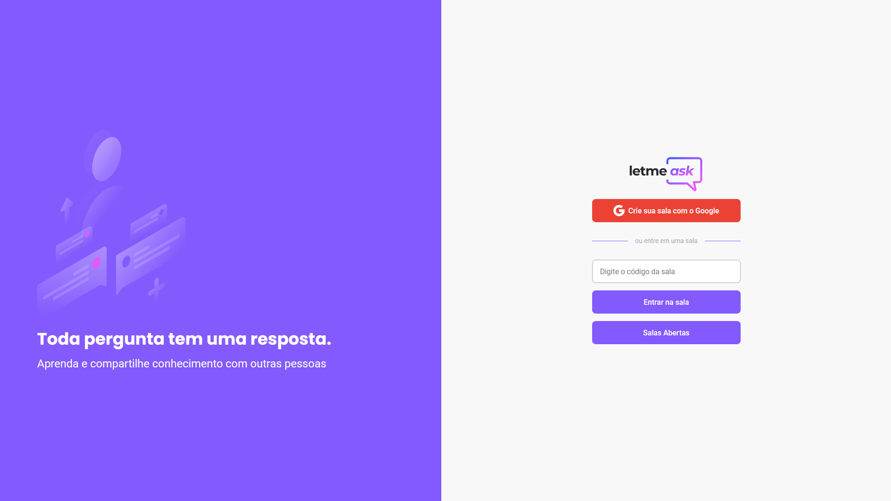
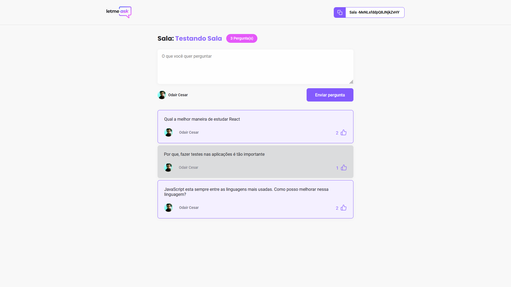
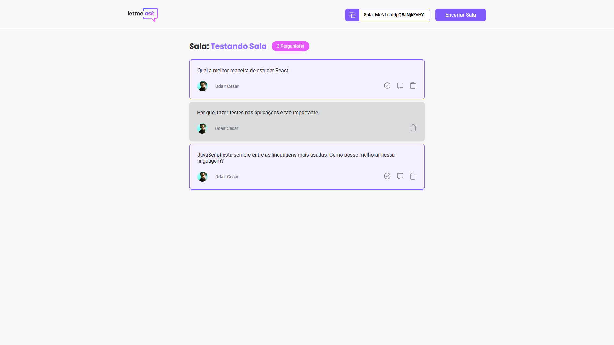
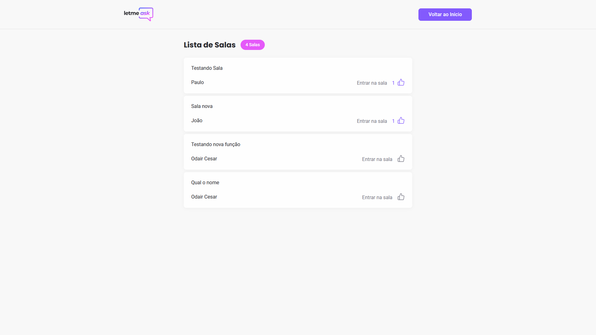
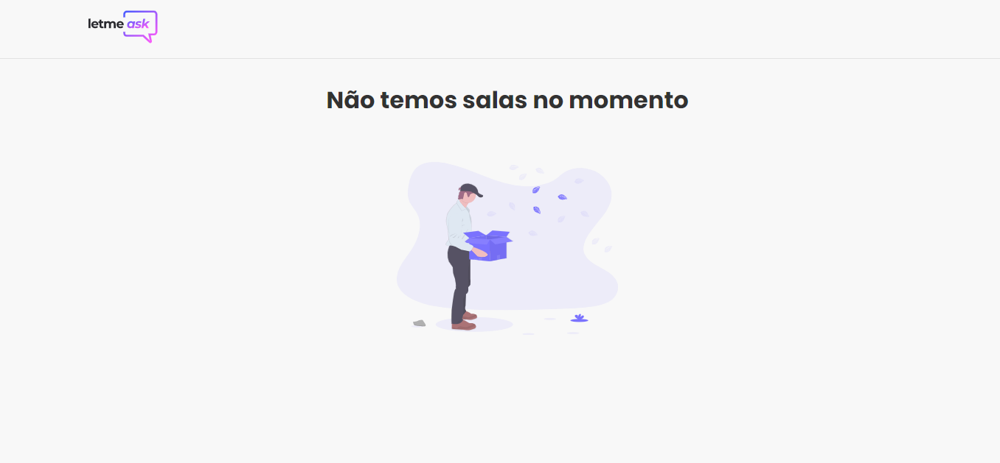

### Aplicação desenvolvida

---

---

### Tecnologias
Esse projeto foi desenvolvido utilizando as seguintes tecnologias:

- [ReactJS](https://reactjs.org/)
- [Typescript](https://www.typescriptlang.org/)
- [Firebase Authentication](https://firebase.google.com/products/auth)
- [Firebase Realtime Database](https://firebase.google.com/products/realtime-database)

### Navegação
  <a href="#dia-1">Dia 1</a>&nbsp;&nbsp;&nbsp;|&nbsp;&nbsp;&nbsp;<a href="#dia-2">Dia 2</a>&nbsp;&nbsp;&nbsp;|&nbsp;&nbsp;&nbsp;<a href="#dia-3">Dia 3</a>&nbsp;&nbsp;&nbsp;|&nbsp;&nbsp;&nbsp;<a href="#dia-4">Dia 4</a>&nbsp;&nbsp;&nbsp;|&nbsp;&nbsp;&nbsp;<a href="#dia-5">Dia 5</a>&nbsp;&nbsp;&nbsp;|&nbsp;&nbsp;&nbsp;<a href="#minhas-alterações-no-projeto">Minhas alterações no projeto</a>

## 💻 Projeto

O letmeask é um app desenvolvido durante a NLW que permite que alguém realizando lives crie uma sala para receber perguntas, tendo maior interação com o usuário.

## Dia 1 
<h2> Configuração de ambiente </h2>

 Foi dado inicio ao aplicativo React com <code>yarn create react-app letmeask --template typescript</code>

Tópicos que eu considerei importantes no dia:

<ul>
  <li> Introdução ao Typescript </li>
  <li> Introdução ao Firebase </li>
  <li> Resumo sobre SPA </li>
  <li> Benefícios na utilizando de functions no React </li>
  <li> Introdução a Hooks </li>
</ul>

## Dia 2 
<h2> Páginas iniciais e autenticação </h2>

 Uma bomba de conteúdo! Começamos com uma simples página com HTML e SCSS e então partimos para o início do método de autenticação. 

 Primeiro fizemos a integração do <code>react-router-dom</code> para navegar pelas páginas, então fizemos o método de login pelo google utilizando o firebase. Com uma função assíncrona <code>async function signInWithGoogle()</code> definimos o provedor como <code>const provider = firebase.auth.GoogleAuthProvider()</code> e definimos o resultado como <code>const result = await auth.signInWithPopup(provider)</code>

 Nesse ponto, se o cliente concluir a autenticação já temos um <code>result</code> com várias informações, que permite a gente a criar uma estrutura condicional para o nosso código, então podemos checar se o cliente tem foto, nome. 

     
      if (result.user) {
      const { displayName, photoURL, uid} = result.user;
      
      if(!displayName || !photoURL) {
        throw new Error('Missing information from Google Account.')
      };

      setUser({
        id: uid,
        name: displayName,
        avatar: photoURL
      });
      };

 Se o usuário não possuir um nome e foto de perfil, a função retornará um erro com uma string, se ele tem todos os dados, a função vai "setar" o estado com os dados novos do usuário.

Para manter os dados do usuário caso ele atualize a página foi utilizado o <code>useEffect</code>, foi usado dentro da função um observador para garantir que o objeto Auth não esteja em um estado intermediário (como inicialização) ao identificar o usuário atual.

Por fim, foi feito uma refatoração do código, todo o AuthContext foi passado para um arquivo TSX próprio, e foi criado também o arquivo UseAuth.js para simplificar o uso de hooks

    import { useContext } from 'react';
    import { AuthContext } from '../contexts/AuthContext';

    export function useAuth() {
      const value = useContext(AuthContext)
      return value
    };

## Dia 3 
<h2> Criando novas salas e novas perguntas</h2>

Para criar uma nova sala no database do firebase precisamos da função 
  <code>firebase.database().ref()</code> que retorna uma referência, que é uma localização dentro da database do Firebase.
assim podemos escrever :

      const roomRef = database.ref('rooms');

      const firebaseRoom = await roomRef.push({
            title: newRoom,
            authorId: user?.id,
          })

Dessa maneira, estamos passando para a database na localização "rooms" um objeto contendo <code>title</code> e <code>authorId</code> que foi passado pelo usuário. 

Depois de feito o scss da Sala, foi criado um component RoomCode para apenas pegar o código. 

Para ter acesso ao código utilizamos o useParams do react-router-dom e para poder guardar os valores precisamos definir uma constante:

       
       const params = useParams();

porém, precisamos definir quais são os parametros que queremos receber nessa rota.

então definimos:

      type RoomParams = {
        id: string;
      }

então fica:

    const params = useParams<RoomParams>();

agora a função sabe quais parametros vai receber.

e agora usamos o componente criado e passamos esse parametro como uma prop: 

    <RoomCode code={params.id} />

Criamos uma pequena função para o botão de copiar o numero da sala

    function copyRoomCodeToClipboard() {
        navigator.clipboard.writeText(props.code)
      }

O próximo passo é fazer o botão de enviar questões funcionar.

Para isso definidos um novo estado chamado newQuestion 

    const [newQuestion, setNewQuestion] = useState('')

e importamos também o user que guardamos com a função <code>signInWithGoogle()</code>

agora é só checar se a perguntava enviada tem mesmo algum conteúdo. 

    if (newQuestion.trim() === "") {
          return
        }

e verificar se o usuário está logado.

    if(!user) {
      throw new Error('You must be logged in');
    }

se passar por essas condições, definimos um objeto com os dados da nova pergunta e os dados do usuário. 

    const question = {
          content: newQuestion,
          author: {
            name: user?.name,
            avatar: user.avatar,
          },
          isHighlighted: false,
          isAnswered: false
        }

<code>isHighlighted</code> e <code>isAnswered</code> com valores booleanos para no futuro termos um controle da interface de acordo com seus valores.
	
então passamos esse objeto para a database com 

    await database.ref(`rooms/${roomId}/questions`).push(question)

E para consumir questões da database do Firebase vamos utilizar o hook <code>useEffect(() => {}, [])</code> para buscar no firebase os dados das perguntas.

    useEffect(() => {
        const roomRef = database.ref(`rooms/${roomId}`);

        roomRef.on('value', room => {
          console.log(room.val());
        })
      }, []) 

Este evento <code>.on</code> irá disparar uma vez com os dados iniciais armazenados neste local e, em seguida, disparar novamente cada vez que os dados forem alterados.

O <code>console.log(room.val())</code> vai nos devolver um objeto com authorId:string, questions:object, title:string.

então definimos o tipo de objeto

    //Record para tipar objetos, e dentro de <> fica o tipo da chave
    type FirebaseQuestions = Record<string, {
      author: {
        name: string;
        avatar: string;
      }
      content: string; 
      isAnswered: boolean;
      isHighlighted: boolean;
    }>

então definimos a constante: 

    const firebaseQuestions: FirebaseQuestions = databaseRoom.questions;

e transformamos esse objeto em um vetor com <code>Object.entries();</code>

    const parsedQuestions = Object.entries(firebaseQuestions)

dessa forma o objeto <code>{"name": "Eduardo", "cidade": "belém"}</code> vai retornar <code>[["name", "eduardo"], ["cidade","belém"]]</code>

então podemos utilizar o <code>.map(value => {})</code> tratando o <code>value</code> como um vetor, fazendo uma desestruturação sabendo que o primeiro valor é a chave e o segundo valor é o valor dessa chave. <code>[key, value]</code>

    const parsedQuestions = Object.entries(firebaseQuestions).map(([key, value]) => {
            return {
              id: key,
              content: value.content,
              author: value.author,
              isHighlighted: value.isHighlighted,
              isAnswered: value.isAnswered,
            }
          })

agora que temos um [] que contém um object com as perguntas, precisamos salvar isso em algum estado.

Criamos um para as perguntas e um para o titulo.  

    const [questions,setQuestions] = useState<Question[]>([])
    const [title, setTitle] = useState('')

e definimos o tipo do estado das perguntas: 

    type Question = {
      id:string;
      author: {
        name: string;
        avatar: string;
      }
      content: string; 
      isAnswered: boolean;
      isHighlighted: boolean;
    }

e passamos os valores para os estados ainda dentro de <codeuseEffect()</code>

    setTitle(databaseRoom.title)
    setQuestions(parsedQuestions)

Agora basta usarmos essas informações na interface. 

## Dia 4 

<h2>Estrutura das perguntas HTML e CSS</h2>

Foi feito um componente Question com HTML e CSS para servir como a div que vai conter as perguntas.
Esse componente foi importado para Room.tsx onde foi feito um <code>.map()</code> nele.

	{questions.map(question => {
		      return (
			<Question
			  key={question.id}
			  content={question.content}
			  author={question.author}
			/>
		      )
		    })}

Agora todo item contido em questions vai retornar como um componente <code>Question</code>.

<h2>Criando o hook useRoom</h2>

Criamos uma função chamada <code>useRoom()</code> e agora temos que trazer todas as funcionalidades que vão ser utilizadas tanto na página do usuário quanto na página do admin .
Então pegamos a parte de carregamento das questões 

Passamos as funções de <code>useEffect()</code> do arquivo Room.tsx, suas tipagens, os estados:questions e title, e então exportamos dessa função <code>useRoom()</code> apenas as perguntas e os titulos, para que possamos importar de volta no Room.tsx.

	
	return { questions, title }. 

	

Mas para que o firebase consiga localizar aonde queremos fazer a referência no banco de dados é necessário do <code>roomId</code>, que é os pedaços dinâmicos do URL da página que colocamos como placeholder no path, precisamos passar essa rota para o <code>useRoom()</code>, então : <code>useRoom(roomId: string)</code>

Agora quando usarmos o hook na page Room.tsx passamos o <code>roomId</code>, que é o id da pagina no Route que foi inserido pelo <code>handleCreateRoom</code> na page NewRoom.tsx

	const { questions, title } = useRoom(roomId)

Feito isso, o código na page Room.tsx já parece muito mais limpo e podemos aproveitar essa funcionalidade na página do admin!

Criamos a page AdminRoom.tsx copiando toda a page Room.tsx, retiramos todo o <code>form</code> e adicionamos o componente <code>Button</code> no header. 

No componente <code>Button</code> foi passado um type <code>{ isOutlined?: boolean }</code> e nas props da function agora podemos passar <code>({isOutlined = false, ...props})</code> 

Então colocamos uma condicional no className:

	
	className={`button ${isOutlined? 'outlined' : ''}`}

	
E agora caso <code>isOutlined</code> seja <code>true</code> a classe outlined também é aplicada. 

<h2>Criando funcionalidade de Like</h2>

Depois de feito o CSS do botão do like, é criado na page Room.tsx uma função assíncrona que recebe a <code>questionId</code> e a informação se já foi dado o like ou não.

	handleLikeQuestion(questionId:string, likeId: string | undefined) {}

essa função vai fazer o push para a database com o authorId.

Primeiro fazemos uma condição para saber se o usuário já deu o like ou não.

	if (likeId) {
	await database.ref(`rooms/${roomId}/questions/${questionId}/likes/${likeId}`).remove()
	}

Caso retorne false então selecionamos a localização na database.

	await database.ref(`rooms/${roomId}/questions/${questionId}/likes`)

e enviamos os dados nessa localização

	await database.ref(`rooms/${roomId}/questions/${questionId}/likes`).push({
		authorId: user?.id,
	})

Para contarmos os números de likes é necessário voltarmos no nosso hook <code>useRoom()</code>

Adicionamos a linha <code>likeCount: Object.values(value.likes ?? {}).length</code> para que a gente receba a quantidade de objetos com o <code>authorId</code> que foi passado anteriormente e o <code>?? {}</code> serve para caso não tenha nenhum. 

E para acompanhar se o usuário deu like ou não precisamos pegar seus dados de autenticação com <code>useAuth()</code>

	const { user } = useAuth() 

Agora que temos o <code>user.id</code> adicionamos a linha 

	likeId: Object.entries(value.likes ?? {}).find(([ key , like ]) => like.authorId === user?.id)?.[0]

<code>.find()</code> percorre o array até encontrar uma condição que satisfaça o que passamos para ele, retornando seu conteúdo.

<code>?.[0]</code> retorna nulo caso ele não ache nada na posição 0.

Então pegamos cada um dos like e verificamos se o authorId é igual ao <code>user?.id</code>.

Agora adicionamos cada um no QuestionType informando seus tipos. 

	type QuestionType = {
	  id:string;
	  author: {
	    name: string;
	    avatar: string;
	  }
	  content: string; 
	  isAnswered: boolean;
	  isHighlighted: boolean;
	  likeCount: number;
	  likeId: string | undefined;
	}

E atualizamos também a tipagem no FirebaseQuestions

	type FirebaseQuestions = Record<string, {
	  author: {
	    name: string;
	    avatar: string;
	  }
	  content: string; 
	  isAnswered: boolean;
	  isHighlighted: boolean;
	  likes: Record<string, {
	    authorId:string;
	  }>
	}>

para remover todos os event listener utilizamos 

	return () => {
	roomRef.off('value')
	}

E no final adicionamos <code>user?.id</code> no array de dependências, pois essa variável não está sendo definida dentro do <code>useEffect()</code>

Então fica: 

	useEffect(() => {
	    const roomRef = database.ref(`rooms/${roomId}`);

	    roomRef.on('value', room => {
	      const databaseRoom = room.val();
	      const firebaseQuestions: FirebaseQuestions = databaseRoom.questions ?? {};

	      const parsedQuestions = Object.entries(firebaseQuestions).map(([key, value]) => {
		return {
		  id: key,
		  content: value.content,
		  author: value.author,
		  isHighlighted: value.isHighlighted,
		  isAnswered: value.isAnswered,
		  likeCount: Object.values(value.likes ?? {}).length,
		   likeId: Object.entries(value.likes ?? {}).find(([key, like]) => like.authorId === user?.id)?.[0],
		}
	      })

	      setTitle(databaseRoom.title)
	      setQuestions(parsedQuestions)
	    })

	    return () => {
	      roomRef.off('value')
	    }
	  }, [roomId, user?.id]) 

Então agora no botão adicionamos uma classe para caso <code>likeId</code> retorne o Id do usuário.

	className={`like-button ${question.likeId ? 'liked' : ''}`}

E a função onClick:

	onClick={() => handleLikeQuestion(question.id, question.likeId)}

Pronto! a funcionalidade de dar like está completa. 

<h2>Remoção de pergunta sem o modal</h2>

Precisamos criar um botão dentro de <code><Questions></code>  que recebe a função <code>handleDeleteQuestion(question.id)</code>
E essa função assíncrona que recebe uma string:

	async function handleDeleteQuestion(questionId: string) {
	    if (window.confirm('Tem certeza que deseja excluir essa pergunta?')) {
	      await database.ref(`rooms/${roomId}/questions/${questionId}`).remove();
	    }
	}

Se <code>window.confirm()</code> retornar <code>true</code>, ele acha a pergunta com a questionId na <code>.ref()</code> passada e remove a pergunta com <code>.remove()</code>

Para encerrar a sala criamos uma função para fazer o update do objeto no banco de dados para conter a data que a sala foi encerrada e enviamos o usuário para a tela inicial do app, então:

	 const history = useHistory()

	 async function handleEndRoom () {
	    database.ref(`rooms/${roomId}`).update({
	      endedAt: new Date()
	    })
	    history.push('/')
	 }

E para evitar que pessoas entrem na sala colocamos no <code>handleJoinRoom()</code> do Home.tsx a seguinte condicional : 
	
	if (roomRef.val().endedAt) {
	      alert('Room already closed');
	      return;
	    }
	
Fim do dia 4! Ufa!

	

## Dia 5 
	
<h2> Criação dos botões  </h2>

Muito HTML e CSS para as criações dos botões <code>handleCheckQuestionAsAnswered</code> e <code>handleHighlightQuestion</code>

Foi atualizado as tipagens do component Questions 

		type QuestionProps = {
		  content: string;
		  author: {
		    name: string;
		    avatar: string;
		  }
		  children?: ReactNode;
		  isAnswered?: boolean;
		  isHighlighted?: boolean;
		}

E então exporta esse componente recebendo <code>false</code> como a prop default 
	
	
	export function Question({
	  content,
	  author,
	  isAnswered = false,
	  isHighlighted = false,
	  children,
	}
	
E adicionado suas respectivas classes de acordo com o valor desses estados]
	
	 className={cx(
        'question',
        { answered: isAnswered},
        { highlighted: isHighlighted && !isAnswered}
      )}
	

<h2>Hospedando o projeto</h2>

O hosting é feito com o próprio hosting do Firebase.

O primeiro passo é instalar o Firebase Tools

	npm install -g firebase-tools

E então fazer o login no google
	
	firebase login

Ir para a pasta do projeto e executar este comando no diretório raiz do seu app:
	
	firebase init
	
E precisamos dizer quais features estamos usando do Firebase, no nosso caso: Realtime Database e Hosting. 
Escolhemos usar um projeto já existente e selecionamos o public diretory : build, que é o arquivo que o create-react-app gera os arquivos para produção.
Perguntam se é uma SPA e respondemos que sim.

Agora que temos o firebase.json e os outros arquivos na nossa aplicação estamos prontos para por em produção. 
	
Rodamos a build do projeto  
	
	yarn build
	
e iniciamos o deploy. 
	
	firebase deploy
	
E a aplicação já está funcionando online. 
	

	
## Minhas alterações no projeto

<h2> Criar a página de lista de salas </h2>
	
	
Primeiro criei um estado para armazenar esses dados.
	

	const [listRooms, setListRooms] = useState<RoomType>([])
	
	
para criar a página de lista de salas, criei o arquivo RoomList.tsx e usei o hook <code>useEffect()</code> para carregar os dados necessários para renderizar a sala. 
	

Peguei a referência do meu banco de dados. 
	
	const databaseRef = database.ref(`rooms`)

Então li todos os dados e retornei eles em um array contendo vários objetos.

	databaseRef.once('value', rooms => {
      const dbRoom: FirebaseRooms = rooms.val() ?? {}

      const parsedRooms = Object.entries(dbRoom).map(([key,value]) => {
        return {
          authorId: key,
          authorName: value.authorName,
          title: value.title,
          roomIsOpen: value.roomIsOpen,
          likeCount: Object.values(value.likes ?? {}).length,
          likeId: Object.entries(value.likes ?? {}).find(([key, like]) => like.authorId === user?.id)?.[0]
        }
      })

      setListRooms(parsedRooms)
    })
	
Fiz as devidas tipagens de como eu queria esse objeto dentro do array.
	
	type RoomType = {
  		authorId: string,
  		authorName: string,
		title: string,
  		roomIsOpen?: boolean,
  		likeCount: number,
  		likeId: string | undefined
	}[]
	
Agora só preciso utilizar <code>.map()</code> para me retornar as salas no formato que eu quero, porém, também quero mostrar algo caso não tenha nenhuma sala disponível.
	
Então crio a seguinte condicional: 
	
	{listRooms.map( rooms =>{
        return(
            <ItenRoom authorId={rooms.authorId} authorName={rooms.authorName} title={rooms.title}>
                <button className={ `like-button ${rooms.likeId? 'liked': ''}`} type="button" aria-label="Marcar como gostei" onClick={() => handleLikeRoom(rooms.authorId, rooms.likeId)}>
                    {rooms.likeCount > 0 && {rooms.likeCount}}
                    <svg width="24" height="24" viewBox="0 0 24 24" fill="none" xmlns="http://www.w3.org/2000/svg">
                        <path d="M7 22H4C3.46957 22 2.96086 21.7893 2.58579 21.4142C2.21071 21.0391 2 20.5304 2 20V13C2 12.4696 2.21071 11.9609 2.58579 11.5858C2.96086 11.2107 3.46957 11 4 11H7M14 9V5C14 4.20435 13.6839 3.44129 13.1213 2.87868C12.5587 2.31607 11.7956 2 11 2L7 11V22H18.28C18.7623 22.0055 19.2304 21.8364 19.5979 21.524C19.9654 21.2116 20.2077 20.7769 20.28 20.3L21.66 11.3C21.7035 11.0134 21.6842 10.7207 21.6033 10.4423C21.5225 10.1638 21.3821 9.90629 21.1919 9.68751C21.0016 9.46873 20.7661 9.29393 20.5016 9.17522C20.2371 9.0565 19.9499 8.99672 19.66 9H14Z" stroke="#737380" stroke-width="1.5" stroke-linecap="round" stroke-linejoin="round"/>
                    </svg>
                </button> 
            </ItenRoom>)
        })
    }

Agora, se rooms contém algum resultado vai aparecer: 
	

	
	
	
	
E se não tiver resultado: 
	
	

